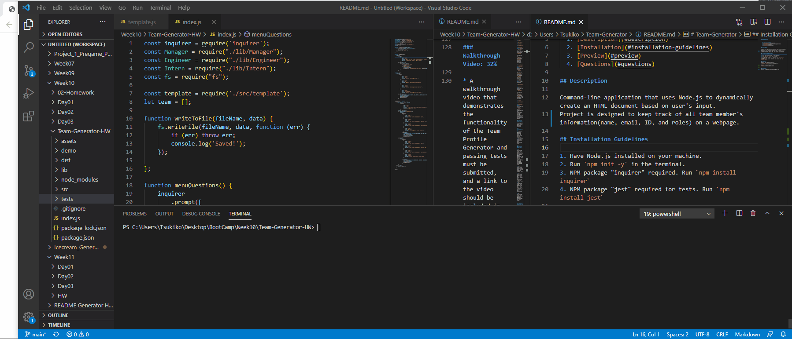

# Team-Generator

  ## Table of Contents 
  1. [Description](#description) 
  2. [Installation](#installation-guidelines) 
  3. [Preview](#preview) 
  4. [Questions](#questions) 

## Description

Command-line application that uses Node.js to dynamically create an HTML document based on user's input.
Project is designed to keep track of all team member's information(name, email, ID, and roles) on a webpage.

## Installation Guidelines

1. Have Node.js installed on your machine.
2. Run `npm init -y` in the terminal.
3. NPM package "inquirer" required. Run `npm install inquirer` 
4. NPM package "jest" required for tests. Run `npm install jest` 

## Preview
Demo of the command-line tests

Demo of project functionality

## Questions
Contact me by email: Rachel7113@gmail.com